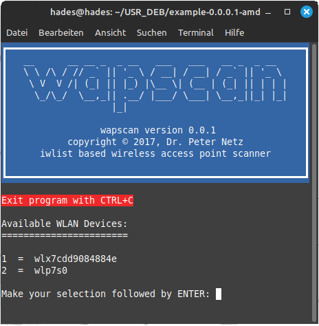

# WELCOME to the WapScan Package
    __      __ __ _  _ __   ___   ___   __ _  _ __     
    \ \ /\ / // _` || '_ \ / __| / __| / _` || '_ \    
     \ V  V /| (_| || |_) |\__ \| (__ | (_| || | | |   
      \_/\_/  \__,_|| .__/ |___/ \___| \__,_||_| |_|   
                    |_|                                

> [!NOTE]
> I started working on this package on March the 1st, 2024. So be patient until I remove this note. At that time, all the necessary information will be included here. The removal of the note is then followed by the usual irregular updating of the software.
>

#  README

This repository consists of <code>Bash</code> based <code>Wireless Access Point Scanner</code> for the command line. The user can decide, if he is using the bunch of scripts or if the DEB package is used.

## Foreword

I started working on the <code>Wireless Access Point Scanner</code> in the year 2017. The goal was to program a simple wi-fi scanner that has the ability to address different hardware devices. When you are using the scanner you will be asked which wlan device should be used. Then the data will be collected pretty printed in the terminal window and contiously updated. In 2017 I wrote a bunch of scripts related to Wi-fi or WLAN. For one one I created script which automatically prepared a package manager for packaging a DEB package.

## Prerequisites

The wireless access point scanner will run on Linux Mint and should be also run on Linux Ubunto and also on Debian like operating systems. I developed 
 the scanner on Linux Mint for usage on Linux Mint.

## Introductory Words

Before I started the development I was looking for a good name. After finding a name I checked if there will be a package with the same name [1]. No match said to me that this will be a good name.

# Repository Organisation 

This repository will have three parts:

1. How to create a DEB
2. Source code used for packaging
3. Scripts which are used within the package

# Look and Feel

You can run 4 versions:

1. wapscan_simple (not preferred)
2. wapscan        (for regular usage)
3. wapscan_beacon (for user who needs two konow how often beacons can be seen)
4. wapscan_oui    (for user who needs to know which hardware the AP is using)

First, you choose the WLAN device for scanning:

The first data is collected and than the WLAN environment is scanned continously.

# References

[1]    www&#8203;.linuxuprising.com/2018/10/how-to-search-available-packages-from.html

[2]    wiki.ubuntuusers.de/WLAN/
