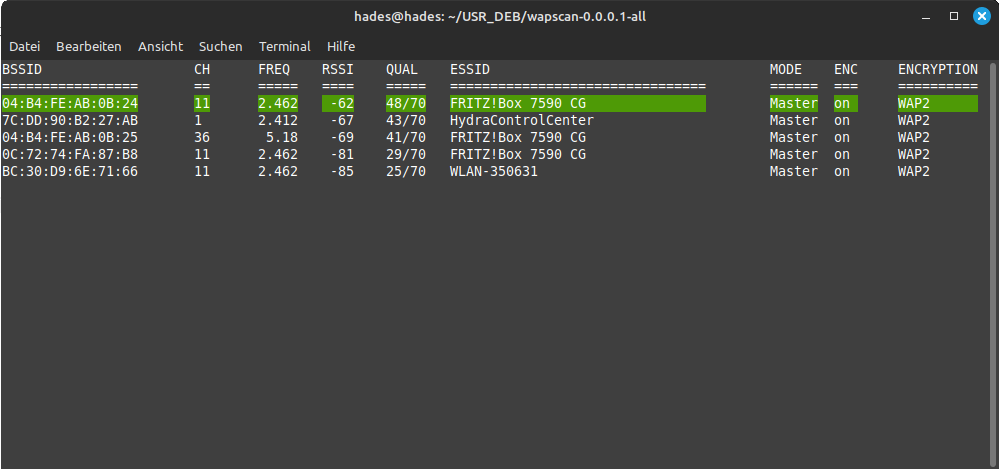

# Wireless Access Point Scanner

<pre>
    __      __ __ _  _ __   ___   ___   __ _  _ __     
    \ \ /\ / // _` || '_ \ / __| / __| / _` || '_ \    
     \ V  V /| (_| || |_) |\__ \| (__ | (_| || | | |   
      \_/\_/  \__,_|| .__/ |___/ \___| \__,_||_| |_|   
                    |_|                                
</pre>

> [!NOTE]
> I started working on this package on March the 1st, 2024. So be patient until I remove this note. At that time, all the necessary information will be included here. The removal of the note is then followed by the usual irregular updating of the software.

#  README

This repository consists of <code>Bash</code> based <code>Wireless Access Point Scanner</code> for the command line. The user can decide, if he is using the bunch of scripts or if the DEB package is used.

## Foreword

The work on the <code>Wireless Access Point Scanner</code> started in the year 2017. The goal was to program a simple wifi scanner that has the ability to address different wlan hardware devices. After invokation the wireless access point scanner is asking which wlan device should be used for scanning. Then the data will be collected and afterwards pretty printed in the terminal window and after that contiously updated.

    

Next to the wireless access point scanner I wrote over the years a bunch of scripts related to wifi or wlan. For the wireless access point scanner I created a script which automatically prepares a package for packaging as <code>DEB</code> package.

The first package I am releasing is in the first shot for educational purposes. In the following versions I will move on to productive versions.

## Short Description

The wireless access point scanner is listing 2.4 GHz as well as 5 GHz access points. Four versions of the wireless access point scanner can be used. But only three of them are of interest:

1. wapscan
2. wapscan_beacon
4. wapscan_oui
  

wapscan is the base apllication. wapscan_beacon and wapscan_oui offer further informations. Sometimes it is of interest how often an access point is sending the beacon. This is monitored by wapscan_beacon. It can also be of interest to know the hardware on which the access point runs. The is realised by wapscan_oui.

The wireless access point scanner is well tested on für wlan on 2.4 GHz. Wlan on 5 GHz were not of interest up to now. So it has also be tested a little bit more.

## Prerequisites

The wireless access point scanner will run on Linux Mint and should be also run on Linux Ubunto and also on Debian like operating systems. I developed 
 the scanner on Linux Mint for usage on Linux Mint.

# Introductory Words

Before I started the development I was looking for a good name. After finding a name I checked if there will be a package with the same name [1]. No match said to me that this will be a good name.

## Repository Organisation 

This repository will have three parts:

1. How-to for creating the DEB package from scratch
2. Required directory tree structure for packaging of the DEB package 
3. Source code in form of some Bash scripts used for packaging

## Look and Feel

You can run 4 versions:

1. wapscan_simple (not preferred)
2. wapscan        (for regular usage)
3. wapscan_beacon (for user who needs two konow how often beacons can be seen)
4. wapscan_oui    (for user who needs to know which hardware the AP is using)

First, you choose the WLAN device for scanning:

The first data is collected and than the WLAN environment is scanned continously.

Example image with both 2.4 GHz as well as 5 GHz access points.

# Program Technical Background

To avoid reinventing the wheel, I always look for the simplest solutions. I found the tools available at command level suitable for a WLAN scanner.

I found the tools available at command level suitable for a WLAN scanner.

I use the tools iw and iwlist. For hardware identification iw is well suited and for WLAN scanning iwlist.

# To-Do

A review of the code is necessary. Since the program is now accessible to the general public, a few additional modifications are necessary.

# Installation

To use the created DEB package one needs at least Debian 12, Ubuntu Jammy, Mint Vanessa or Rapsian Bookworm. The problem is the internal usage of the zst compression, which was introduced with Debian 12.

# Outlook

As soon as I'm done here in the repository, I'll see if a PPA is suitable for my first application.

# References

[1]    www&#8203;.linuxuprising.com/2018/10/how-to-search-available-packages-from.html

[2]    wiki.ubuntuusers.de/WLAN/

[3]    www&#8203;.hpl.hp.com/personal/Jean_Tourrilhes/Linux/Tools.html

[4]    wireless.wiki.kernel.org/en/users/documentation/iw

[5]    github.com/HewlettPackard/wireless-tools

[6]    packages.debian.org/sid/wireless-tools

File last modified 02/03/2024

